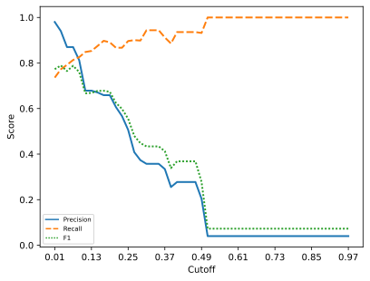
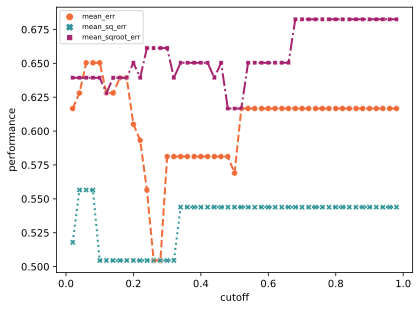

# tada-qq-experiment

[](https://ahmad88me.semaphoreci.com/projects/tada-qq-experiment)
[](https://codecov.io/gh/ahmad88me/tada-qq-experiment)

[](https://www.python.org/downloads/release/python-360/)
[](https://www.python.org/downloads/release/python-370/)
[](https://www.python.org/downloads/release/python-380/)


Semantic labelling and experiments using [tada-qq](https://github.com/oeg-upm/tada-qq)


## Datasets
### Olympic Games Dataset

The data is available here: [](https://doi.org/10.5281/zenodo.1408562)

We have a script to download the data automatically here `scripts/olympic-download.sh` 
You can run it as follows:```sh scripts/olympic-download.sh```

<!--
## Data
1. Download the csv files from here: [](https://doi.org/10.5281/zenodo.1408562)
1. Create a folder `local_data/olympic_games/data`
1. Put the csv files of the Olympic games inside it.
1. Put the `meta.csv` in `local_data/olympic_games`
-->

#### To cite the Olympic Games dataset
```
@dataset{alobaid_ahmad_2018_1408562,
  author       = {Alobaid, Ahmad and
                  Corcho, Oscar},
  title        = {Olympic Games 2020},
  month        = sep,
  year         = 2018,
  publisher    = {Zenodo},
  doi          = {10.5281/zenodo.1408562},
  url          = {https://doi.org/10.5281/zenodo.1408562}
}
```

### T2Dv2
#### Automatic
1. `pip install requests chardet`
2. To download and transform the data automatically, you can use [this](scripts/prep_t2dv2.py)
script.
3. Make sure to use the Updated typology CSV file [T2Dv2_typology.csv](https://zenodo.org/record/6334120).


#### Manual
* [T2Dv2_typology.csv](https://zenodo.org/record/6334120)
* [T2Dv2](http://webdatacommons.org/webtables/extended_instance_goldstandard.tar.gz)

#### Extra preprocessing
The application expects to have a folder named `csv` inside the T2Dv2 which includes the files in csv format. You can use the script `scripts/json_to_csv.py` to do that.


## Clustering Experiments

Matching similar columns. The main differences between the clustering and the semantic labelling are:
1. Clustering does not add an annotation to the cluster.
2. The clustering does not use the knowledge graph.
3. The clustering does not take into account the subject class/type.

The commands used: 
```
python -m clus.t2dv2 --range 0.01 1.0 --inc 0.02
python -m clus.t2dv2 --range 0.01 1.0 --inc 0.02 -m
```

To show the clusters
```
python -m clus.t2dv2 -c 0.02 -m
python -m clus.t2dv2 -c 0.9 
```
*Using a single cutoff value would show the cluster figure (but won't generate a diagram file as it is mainly used for debugging or illustrative purposes)*

### Clustering Results - T2Dv2

#### Class Agnostic



#### Same Class


## Semantic labelling with QQ
### Olympic Games
Command used:
```
python -m slabelexp.olympic
```

#### Results

|  remove outlier |  estimate |    error method | Precision |    Recall |    F1 |
|:---------------:|:---------:|:---------------:|:---------:|:---------:|:-----:|
|            True |  estimate |        mean_err |      0.88 |      1.00 |  0.93 |
|            True |  estimate |     mean_sq_err |      0.88 |      1.00 |  0.93 |
|            True |  estimate | mean_sqroot_err |      0.88 |      1.00 |  0.93 |
|            True |     exact |        mean_err |      0.88 |      1.00 |  0.93 |
|            True |     exact |     mean_sq_err |      0.88 |      1.00 |  0.93 |
|            True |     exact | mean_sqroot_err |      0.88 |      1.00 |  0.93 |
|           False |  estimate |        mean_err |      0.83 |      1.00 |  0.91 |
|           False |  estimate |     mean_sq_err |      0.83 |      1.00 |  0.91 |
|           False |  estimate | mean_sqroot_err |      0.88 |      1.00 |  0.93 |
|           False |     exact |        mean_err |      0.83 |      1.00 |  0.91 |
|           False |     exact |     mean_sq_err |      0.88 |      1.00 |  0.93 |
|           False |     exact | mean_sqroot_err |      0.79 |      1.00 |  0.88 |


### T2Dv2

Arguments
``` 
 usage: t2dv2.py [-h] [-e ERR_METHS [ERR_METHS ...]]
                [-o OUTLIER_REMOVAL [OUTLIER_REMOVAL ...]] [-d]
                [-s ESTIMATE [ESTIMATE ...]] [-w] [-u] [-m] [-a]

Parameters for the experiment

optional arguments:
  -h, --help            show this help message and exit
  -e ERR_METHS [ERR_METHS ...], --err-meths ERR_METHS [ERR_METHS ...]
                        Functions to computer errors.
  -o OUTLIER_REMOVAL [OUTLIER_REMOVAL ...], --outlier-removal OUTLIER_REMOVAL [OUTLIER_REMOVAL ...]
                        Whether to remove outliers or not.
  -d, --diff            Store the diffs
  -s ESTIMATE [ESTIMATE ...], --estimate ESTIMATE [ESTIMATE ...]
  -w, --draw            Whether to generate diagrams
  -u, --summary         Whether to generate a summary diagram
  -m, --mislabel        Whether to print mislabeled files
  -a, --append-to-readme
```


Used:
```
python -m slabelexp.t2dv2 -e mean_err mean_sq_err mean_sqroot_err -o true false --estimate True False --summary -a -w
```


#### Results

##### Performance for the different parameters

|  remove outlier |  estimate |    error method | Precision |    Recall |    F1 |
|:---------------:|:---------:|:---------------:|:---------:|:---------:|:-----:|
|            True |  estimate |        mean_err |      0.49 |      0.84 |  0.62 |
|            True |  estimate |     mean_sq_err |      0.50 |      0.84 |  0.63 |
|            True |  estimate | mean_sqroot_err |      0.51 |      0.85 |  0.64 |
|            True |     exact |        mean_err |      0.45 |      0.83 |  0.58 |
|            True |     exact |     mean_sq_err |      0.49 |      0.84 |  0.62 |
|            True |     exact | mean_sqroot_err |      0.39 |      0.81 |  0.53 |
|           False |  estimate |        mean_err |      0.53 |      0.85 |  0.65 |
|           False |  estimate |     mean_sq_err |      0.53 |      0.85 |  0.65 |
|           False |  estimate | mean_sqroot_err |      0.53 |      0.85 |  0.65 |
|           False |     exact |        mean_err |      0.53 |      0.85 |  0.65 |
|           False |     exact |     mean_sq_err |      0.53 |      0.85 |  0.65 |
|           False |     exact | mean_sqroot_err |      0.50 |      0.84 |  0.63 |


### Number of data points vs performance score per evaluation method

#### Outlier Removal


#### Raw


### Number of data points and performance of different metrics

#### mean error
mean error + estimate + raw


mean error + estimate + outlier removed


mean error + exact + raw


mean error + exact + outlier removed


#### mean square error

mean square error + estimate + raw


mean square error + estimate + outlier removed


mean square error + exact + raw


mean square error + exact + outlier removed


#### mean square root 

mean square root + estimate + raw


mean square root + estimate + outlier removed


mean square root + exact + raw


mean square root + exact + outlier removed


## Merged Experiment (Slab Preference)
Clustering as a way to improve Semantic Labelling


*Note: be default the diagrams and readmes are not updated. You can pass`--draw` to generate/update the diagrams and `-a` to append the results to the readme in the results folder*


### Cluster without class consideration

[comment]: <> (1. with outlier removal and candidate fail back)

[comment]: <> (```)

[comment]: <> (python -m merged.t2dv2 -e mean_err mean_sq_err mean_sqroot_err -o true --estimate True False --pref slab --failback --draw -c 0.02 0.04 0.06 0.08 0.10 0.12 0.14 0.16 0.18 0.20 0.22 0.24 0.26 0.28 0.30 0.32 0.34 0.36 0.38 0.40 0.42 0.44 0.46 0.48 0.50 0.52 0.54 0.56 0.58 0.60 0.62 0.64 0.66 0.68 0.70 0.72 0.74 0.76 0.78 0.80 0.82 0.84 0.86 0.88 0.90 0.92 0.94 0.96 0.98)

[comment]: <> (```)

[comment]: <> (Estimate)

[comment]: <> (![]&#40;results/merged-slab/t2dv2_mer_estimate_reo_ca_cf-f1.svg&#41;)

[comment]: <> (Exact)

[comment]: <> (![]&#40;results/merged-slab/t2dv2_mer_exact_reo_ca_cf-f1.svg&#41;)


1with outlier removal 
```
python -m merged.t2dv2 -e mean_err mean_sq_err mean_sqroot_err -o true --estimate True False --pref slab --draw -c 0.02 0.04 0.06 0.08 0.10 0.12 0.14 0.16 0.18 0.20 0.22 0.24 0.26 0.28 0.30 0.32 0.34 0.36 0.38 0.40 0.42 0.44 0.46 0.48 0.50 0.52 0.54 0.56 0.58 0.60 0.62 0.64 0.66 0.68 0.70 0.72 0.74 0.76 0.78 0.80 0.82 0.84 0.86 0.88 0.90 0.92 0.94 0.96 0.98
```

Estimate


Exact


[comment]: <> (3. with outliers kept and candidate fail back)

[comment]: <> (```)

[comment]: <> (python -m merged.t2dv2 -e mean_err mean_sq_err mean_sqroot_err -o false --estimate True False --pref slab --failback --draw -c 0.02 0.04 0.06 0.08 0.10 0.12 0.14 0.16 0.18 0.20 0.22 0.24 0.26 0.28 0.30 0.32 0.34 0.36 0.38 0.40 0.42 0.44 0.46 0.48 0.50 0.52 0.54 0.56 0.58 0.60 0.62 0.64 0.66 0.68 0.70 0.72 0.74 0.76 0.78 0.80 0.82 0.84 0.86 0.88 0.90 0.92 0.94 0.96 0.98)

[comment]: <> (```)

[comment]: <> (Estimate)

[comment]: <> (![]&#40;results/merged-slab/t2dv2_mer_estimate_raw_ca_cf-f1.svg&#41;)

[comment]: <> (Exact)

[comment]: <> (![]&#40;results/merged-slab/t2dv2_mer_exact_raw_ca_cf-f1.svg&#41;)


2. with outliers kept
```
python -m merged.t2dv2 -e mean_err mean_sq_err mean_sqroot_err -o false --estimate True False --pref slab --draw -c 0.02 0.04 0.06 0.08 0.10 0.12 0.14 0.16 0.18 0.20 0.22 0.24 0.26 0.28 0.30 0.32 0.34 0.36 0.38 0.40 0.42 0.44 0.46 0.48 0.50 0.52 0.54 0.56 0.58 0.60 0.62 0.64 0.66 0.68 0.70 0.72 0.74 0.76 0.78 0.80 0.82 0.84 0.86 0.88 0.90 0.92 0.94 0.96 0.98
```

Estimate


Exact


[comment]: <> (### Force same class clustering)

[comment]: <> (5. with outlier removal and candidate fail back)

[comment]: <> (```)

[comment]: <> (python -m merged.t2dv2 -e mean_err mean_sq_err mean_sqroot_err -o true --estimate True False  --pref slab --failback --sameclass --draw -c 0.02 0.04 0.06 0.08 0.10 0.12 0.14 0.16 0.18 0.20 0.22 0.24 0.26 0.28 0.30 0.32 0.34 0.36 0.38 0.40 0.42 0.44 0.46 0.48 0.50 0.52 0.54 0.56 0.58 0.60 0.62 0.64 0.66 0.68 0.70 0.72 0.74 0.76 0.78 0.80 0.82 0.84 0.86 0.88 0.90 0.92 0.94 0.96 0.98)

[comment]: <> (```)


[comment]: <> (Estimate)

[comment]: <> (![]&#40;results/merged-slab/t2dv2_mer_estimate_reo_sc_cf-f1.svg&#41;)

[comment]: <> (Exact)

[comment]: <> (![]&#40;results/merged-slab/t2dv2_mer_exact_reo_sc_cf-f1.svg&#41;)

3. with outlier removal
```
python -m merged.t2dv2 -e mean_err mean_sq_err mean_sqroot_err -o true --estimate True False --pref slab --sameclass --draw -c 0.02 0.04 0.06 0.08 0.10 0.12 0.14 0.16 0.18 0.20 0.22 0.24 0.26 0.28 0.30 0.32 0.34 0.36 0.38 0.40 0.42 0.44 0.46 0.48 0.50 0.52 0.54 0.56 0.58 0.60 0.62 0.64 0.66 0.68 0.70 0.72 0.74 0.76 0.78 0.80 0.82 0.84 0.86 0.88 0.90 0.92 0.94 0.96 0.98
```


Estimate


Exact


[comment]: <> (7. with outliers kept and candidate fail back)

[comment]: <> (```)

[comment]: <> (python -m merged.t2dv2 -e mean_err mean_sq_err mean_sqroot_err -o false --estimate True False --pref slab --failback --sameclass --draw -c 0.02 0.04 0.06 0.08 0.10 0.12 0.14 0.16 0.18 0.20 0.22 0.24 0.26 0.28 0.30 0.32 0.34 0.36 0.38 0.40 0.42 0.44 0.46 0.48 0.50 0.52 0.54 0.56 0.58 0.60 0.62 0.64 0.66 0.68 0.70 0.72 0.74 0.76 0.78 0.80 0.82 0.84 0.86 0.88 0.90 0.92 0.94 0.96 0.98)

[comment]: <> (```)


[comment]: <> (Estimate)

[comment]: <> (![]&#40;results/merged-slab/t2dv2_mer_estimate_raw_sc_cf-f1.svg&#41;)

[comment]: <> (Exact)

[comment]: <> (![]&#40;results/merged-slab/t2dv2_mer_exact_raw_sc_cf-f1.svg&#41;)

4. with outliers kept
```
python -m merged.t2dv2 -e mean_err mean_sq_err mean_sqroot_err -o false --estimate True False --pref slab --sameclass --draw -c 0.02 0.04 0.06 0.08 0.10 0.12 0.14 0.16 0.18 0.20 0.22 0.24 0.26 0.28 0.30 0.32 0.34 0.36 0.38 0.40 0.42 0.44 0.46 0.48 0.50 0.52 0.54 0.56 0.58 0.60 0.62 0.64 0.66 0.68 0.70 0.72 0.74 0.76 0.78 0.80 0.82 0.84 0.86 0.88 0.90 0.92 0.94 0.96 0.98
```

Estimate


Exact


### Results

[merged results](results/merged/README.md)


## Merged Experiment (Clus Preference)
Clustering as a way to improve Semantic Labelling


1. with outlier removal
```
python -m merged.t2dv2 -e mean_err mean_sq_err mean_sqroot_err -o true --estimate True False -p clus --draw -c 0.02 0.04 0.06 0.08 0.10 0.12 0.14 0.16 0.18 0.20 0.22 0.24 0.26 0.28 0.30 0.32 0.34 0.36 0.38 0.40 0.42 0.44 0.46 0.48 0.50 0.52 0.54 0.56 0.58 0.60 0.62 0.64 0.66 0.68 0.70 0.72 0.74 0.76 0.78 0.80 0.82 0.84 0.86 0.88 0.90 0.92 0.94 0.96 0.98
```

Estimate


Exact


2. with outliers kept
```
python -m merged.t2dv2 -e mean_err mean_sq_err mean_sqroot_err -o false --estimate True False -p clus --draw -c 0.02 0.04 0.06 0.08 0.10 0.12 0.14 0.16 0.18 0.20 0.22 0.24 0.26 0.28 0.30 0.32 0.34 0.36 0.38 0.40 0.42 0.44 0.46 0.48 0.50 0.52 0.54 0.56 0.58 0.60 0.62 0.64 0.66 0.68 0.70 0.72 0.74 0.76 0.78 0.80 0.82 0.84 0.86 0.88 0.90 0.92 0.94 0.96 0.98
```

Estimate


Exact


### Force same class clustering

3. with outlier removal 
```
python -m merged.t2dv2 -e mean_err mean_sq_err mean_sqroot_err -o true --estimate True False -p clus --sameclass --draw -c 0.02 0.04 0.06 0.08 0.10 0.12 0.14 0.16 0.18 0.20 0.22 0.24 0.26 0.28 0.30 0.32 0.34 0.36 0.38 0.40 0.42 0.44 0.46 0.48 0.50 0.52 0.54 0.56 0.58 0.60 0.62 0.64 0.66 0.68 0.70 0.72 0.74 0.76 0.78 0.80 0.82 0.84 0.86 0.88 0.90 0.92 0.94 0.96 0.98
```


Estimate


Exact


4. with outliers kept
```
python -m merged.t2dv2 -e mean_err mean_sq_err mean_sqroot_err -o false --estimate True False -p clus --sameclass --draw -c 0.02 0.04 0.06 0.08 0.10 0.12 0.14 0.16 0.18 0.20 0.22 0.24 0.26 0.28 0.30 0.32 0.34 0.36 0.38 0.40 0.42 0.44 0.46 0.48 0.50 0.52 0.54 0.56 0.58 0.60 0.62 0.64 0.66 0.68 0.70 0.72 0.74 0.76 0.78 0.80 0.82 0.84 0.86 0.88 0.90 0.92 0.94 0.96 0.98
```

Estimate


Exact


### Results

[merged results](results/merged/README.md)


# Installation

## Known issues
* Error installing Pillow on ubuntu: `sudo apt-get install libjpeg-dev`

*Note: the failback option turned out to be useless theoretically and also looking at the result, it is useless too. It should be removed in the future versions*


# Analysis
## Merged
```
python -m merged.single -p clus -e mean_err -s true -c 0.8 -o false
python -m merged.single -p clus -e mean_sq_err -s true -c 0.8 -o false
python -m merged.single -p clus -e mean_sqroot_err -s true -c 0.8 -o false
```

```
python -m merged.single -p clus -e mean_err -s true -c 0.8 -o true -m 
python -m merged.single -p clus -e mean_sq_err -s true -c 0.8 -o true -m 
python -m merged.single -p clus -e mean_sqroot_err -s true -c 0.8 -o true -m 


python -m merged.single -p clus -e mean_err mean_sq_err mean_sqroot_err -s true -c 0.8 -o true -m 

```

    parser = argparse.ArgumentParser(description='Parameters for the experiment')
    parser.add_argument('-e', '--err-meths', default=["mean_err"], nargs="+", help="Functions to computer errors.")
    parser.add_argument('-o', '--outlier-removal', default="true", choices=["true", "false"],
                        help="Whether to remove outliers or not.")
    parser.add_argument('-s', '--estimate', default=["True"], nargs="+")
    parser.add_argument('-c', '--cutoffs', default=[0.1], nargs="+", help="Error cutoff value.")
    parser.add_argument('-m', '--sameclass', action="store_true")  # False by default
    parser.add_argument('-f', '--failback', action="store_true")  # False by default
    parser.add_argument('-p', '--pref', choices=["slab", "clus"], required=True,
                        help="Whether the preference is for the slab predicted or the clus (most voted in the cluster)")


## Semantic labelling with KS


### T2Dv2

Arguments
```

usage: t2dv2.py [-h] [-o OUTLIER_REMOVAL [OUTLIER_REMOVAL ...]] [-d] [-s ESTIMATE [ESTIMATE ...]] [-w] [-u] [--dists DISTS [DISTS ...]] [-m]

Parameters for the experiment

optional arguments:
  -h, --help            show this help message and exit
  -o OUTLIER_REMOVAL [OUTLIER_REMOVAL ...], --outlier-removal OUTLIER_REMOVAL [OUTLIER_REMOVAL ...]
                        Whether to remove outliers or not.
  -d, --diff            Store the diffs
  -s ESTIMATE [ESTIMATE ...], --estimate ESTIMATE [ESTIMATE ...]
                        Whether to show estimates or not.
  -w, --draw            Whether to generate diagrams
  -u, --summary         Whether to generate a summary diagram
  --dists DISTS [DISTS ...]
                        The distance measure to use (sup or pva)
  -m, --mislabel        Whether to print mislabeled files


```


Used:
```
python -m ks.t2dv2 --dist pva sup -o true false --estimate True False --summary --draw -a
```


#### Results
[ks results](results/ks/README.md)

## Semantic Labelling Comparison
This is based on the data from the README.md. They are manually copied to results.csv.


